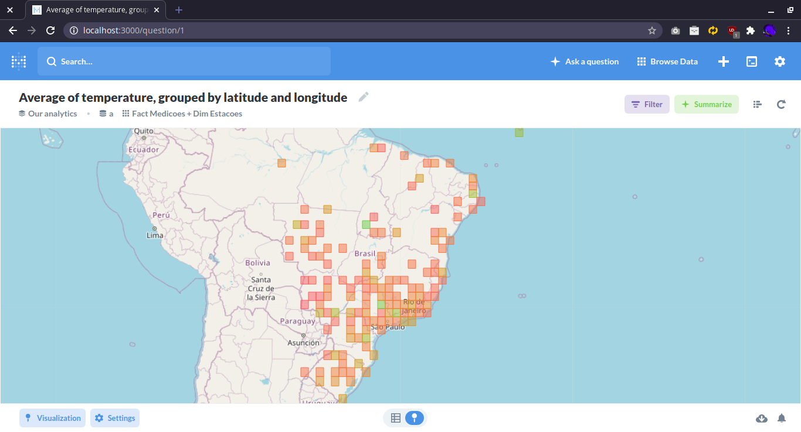
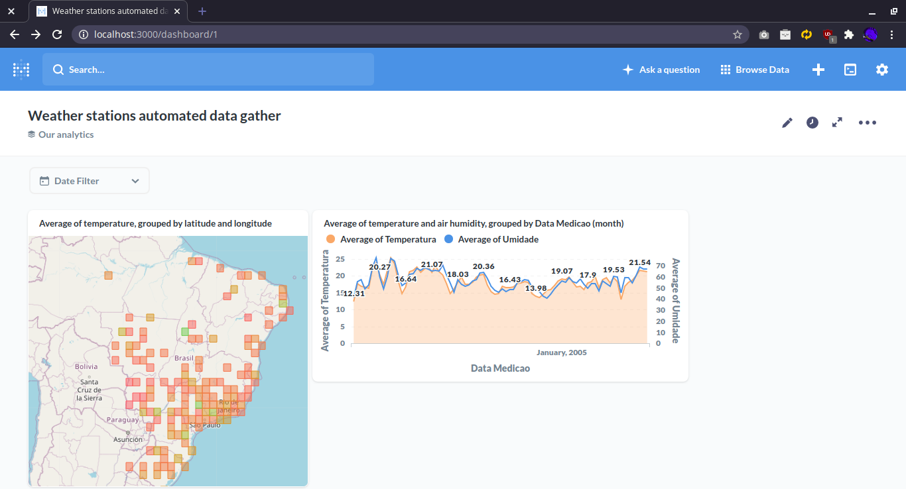

# Weather Stations Data Gather

<code> Docker</code> +
<code> Airflow</code> +
<code> BigQuery</code> +
<code> Metabase</code>

Hi, there! Here we extract data from Brazil weather stations from [INMET](https://portal.inmet.gov.br/dadoshistoricos) open database. After we structure the data (of an awful csv format) with Airflow orchestration with PythonOperator and Bash, the data is uploaded to BigQuery. Now with our sctructured data in the cloud, we use Metabase to create thats beautiful charts.

How INMET gives to us the data packed in zip files organized by years (like 2000.zip and 2001.zip), the Airflow scheduler is programmed to make yearly DAG executions (just to parametrize the data extraction and manipulation, so do incremental uploads in the dtabase). The csv headers (I said they use an awful format) are used to extract the station infos like their map coordinates (longitude and latitude). The other lines of the csv has the column titles and data (temperature, humidity, wind, dew) that we still have to manipulate before read this with pandas.

So, we make data transictions in buckets like loading_zone, raw, processed and dw (in local directories). When we have readable data (at processed), we structure then in dim_estacoes (data about the stations location, region and city) and fact_medicoes (metering date and time and weather data) to upload then to BigQuery (sometime I need to implement a dim_dates) in a dataset called by `dw` (shazam!). The GCP service account should be named as `credentials.json` and located at `dags/credentials/credentials.json` to do this.

