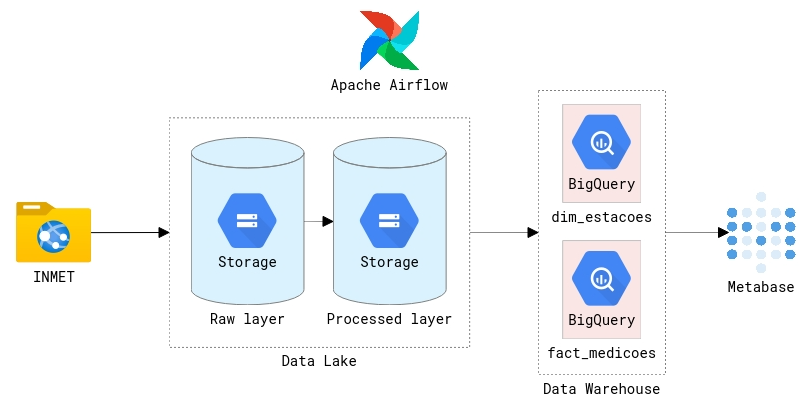
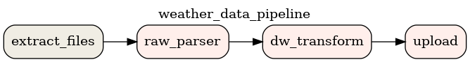

# INMET Weather Stations Data Gather

<code> Docker</code> +
<code> Airflow</code> +
<code> BigQuery</code> +
<code> Metabase</code>

Hi, there! Here we are going to extract data from Brazil weather stations with [INMET](https://portal.inmet.gov.br/dadoshistoricos) open data files. After extraction, we structure the data (of an awful csv format) with Apache Airflow task orchestration with PythonOperator and BashOperator, then the data is uploaded to BigQuery. So, with the structured data in GCS and BigQuery, we use Metabase to create some charts. The following diagram expands this flow.



How INMET gives to us the data packed in zip files organized by years (like `2000.zip` and ~), the Apache Airflow scheduler is programmed to make yearly DAG executions (just to parametrize the data extraction and manipulation, so do incremental uploads in the database). The csv headers (I said they use an awful format) are used to extract the station infos like their map coordinates (longitude, latitude and altitude). The other lines of the csv has the column titles and data (temperature, humidity, wind, dew, etc) that we still have to manipulate before read this with pandas.

So, we make data transitions between buckets like `loading_zone`, `raw`, `processed` and `dw` (in local directories). When we have readable data (at `processed` bucket), we structure then in `dim_estacoes` (data about the station locations, regions and cities) and `fact_medicoes` (metering datetime and weather data) to upload them to BigQuery (someday I need to implement a dim_dates) in a dataset called by `dw` (and shazam!).

## How to use

### Terraform

To create the resources in this project you can run the tf resources described in the `terraform` directory. To accomplish it, build the container with Terraform and gcloud installed:

```shell
# checkout to the terraform directory
cd terraform

# build the dockerfile
make build

# start the docker container with the dataset id, bucket and project names
make start \
    BQ_DATASET={YOUR DATASET ID} \
    GCS_BUCKET={YOUR GCS BUCKET NAME} \
    GOOGLE_CLOUD_PROJECT={YOUR PROJECT NAME}

# login into your gcp account
make gcloud
```

So, you can enter in shell of the container and do the terraform steps like:

```shell
# to enter in the container shell
make shell

# install the project dependencies
terraform init gcp
# plan the resource application
terraform plan gcp
# create the resources as the tf files
terraform apply gcp
```

### Apache Airflow

Build up the docker container with the following command so it will get up our services, Apache Airflow (with postgres) and Metabase:

```shell
# build the docker images
make build

# start the Apache Airflow and Metabase containers
make up \
    BQ_DATASET={YOUR DATASET ID} \
    GCS_BUCKET={YOUR GCS BUCKET NAME} \
    GOOGLE_CLOUD_PROJECT={YOUR PROJECT NAME}
```

At this point, we suppose that you have created your GCP project with the resources in terraform. So, you can login into your GCP account and start the DAG scheduling with this:

```shell
# prompt gcloud auth login to log into your account
make gcloud

# trigger the dag in airflow
make start
```

To follow the dag run, check the Apache Airflow Webserver UI in http://localhost:8000. A DAG similar to the next image should be found in the UI:



To build the charts below, enter in the Metabase UI at http://localhost:3000, set the service account access and create the charts with the SQL files stored in `./sql`.


## References

- https://github.com/robainaricardo/weather-stations-automated-data-gather
- https://portal.inmet.gov.br/dadoshistoricos
- https://airflow.apache.org/docs/stable/howto/index.html
- https://www.metabase.com/docs/latest/setting-up-metabase.html
